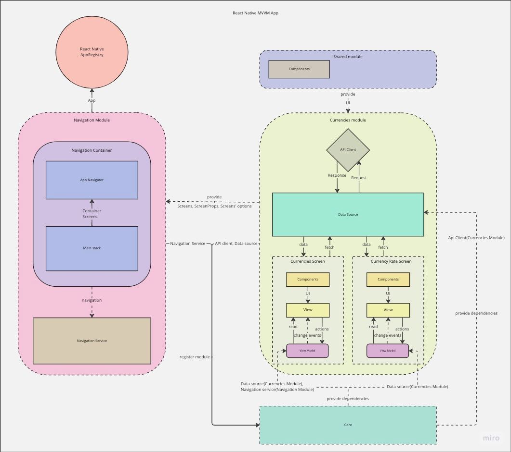
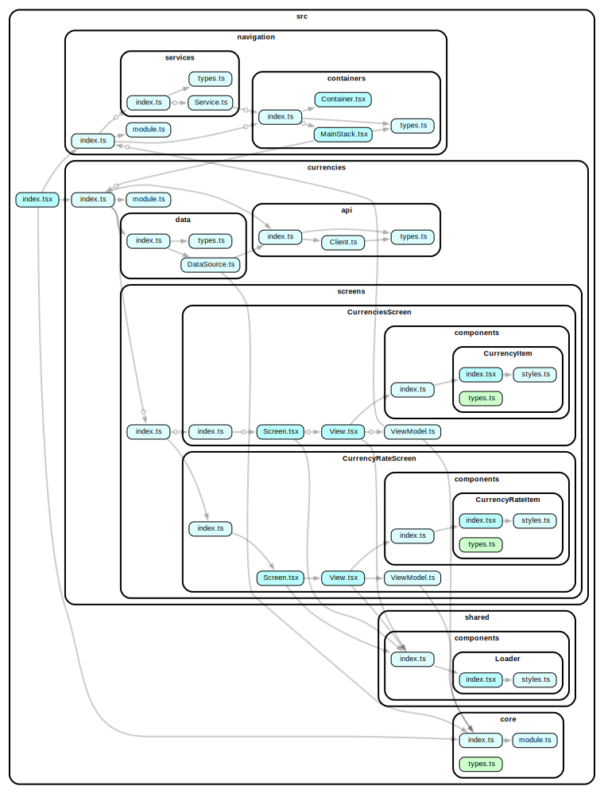

# React Native - MVVM example project

## Purpose of this project
It is an example React Native application which shows how to create a modularized application with MVVM pattern, how to work with modules' entities in project, provide them via "improvised" dependency injection and how to structure your modularized app.

## Uses:
- react-native
- react-navigation
- mobx
- axios

## API
Uses [Currency API](https://github.com/fawazahmed0/currency-api) for example purpose

## Project Structure

* src - all project source code

Project is split into modules
* Navigation - provides all navigational config and structure(containers, types, service etc.)
* shared - all shared data for modules(e.g. global project components)
* core - main module for bootstrapping other modules
* currencies - currency module(screens, api, data etc.)

Each module may consist of:
- Services - utility classes for operations
- API - api clients, network layer
- Data - data sources, models, stores
- Screens - modules' UI part, screens to be used in application's navigation
- module.ts - module bootstrap(intializing and accessing other module's entities)

Each screen has:
- components - screen-scope components(Component oriented pattern)
- View - screen's UI, observer for ViewModel
- ViewModel - all screen logic lives here, based on MobX. Provides all logic and data for View, accesses services, stores, data sources etc.
- Screen - screen bootstrapping, props interface and options for navigation

## Architecture
Application is based on Model-View-ViewModel architecture which provides the ability to split UI and logic

Each screen has View(UI) and ViewModel(logic). Model is currently a REST API provided to View Model through Data Source.

Data Source communicates with network by utilizing provided API client.

Navigation is encapsulated into service which provides View Models the ability to navigate through app(e.g. push new screen)

Navigation containers are based in Navigation module and have all Screens hierarchy in them.

Shared UI and logic are stored in Shared module.

Each module provides itself as lazy initiated singleton. For now all entities provided by modules are also lazy initiated singletons.

Module does not know anything about implementation details, it utilizes interfaces and requires configuration(with init static methods) which provides exact implementations of entities.

Core is a global modules registry. It(as all the modules) is a lazy initiated singleton, provides all modules as singletons. It does not know about exact modules implementation, utilizes module interfaces and requires configuration(with init static method) which provides modules factories.

Module's init method with exact entities implementations is invoked inside module's factory method. All entities are imported only at the moment of module's initialization so if module was not yet requested(and not initialized) then all it's entities(as well as module itself) will not yet be imported into runtime.

You can see graphical visualization of application's architecture below.

#### Dependency graph

### Historical decisions
- Ditched reflect metadata and decorator based IoC due to unexpected behavior and random bundling bugs
- Use global module managers for direct class props injection

### Possible improvements to project
- Store API data in Models with persistence(by MobX store or any database, e.g. - WatermelonDB, Realm etc.)
- Use RePack for chunked bundles, may be Module Federation
- Add more modules, show module-module communication patterns(by utilizing other module's services, stores or by PubSub event-bus)
